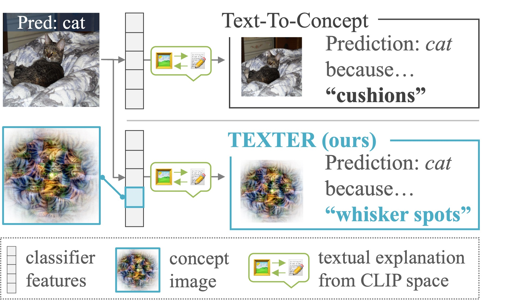

# TEXTER: Zero-Shot Textual Explanations via Translating Decision-Critical Features
[📝 Paper](https://arxiv.org/abs/2512.07245) | [📌 Citation](#citation)
___

Official implementation of **TEXTER**, proposed in *"Zero-Shot Textual Explanations via Translating Decision-Critical Features"*.
TEXTER explains model decisions by translating decision-critical visual features into ranked textual concepts.


*Qualitative TEXTER explanations on ImageNet validation samples.*

## Highlights
- Ready-to-run demo script `demo_texter.py` for ImageNet validation samples.
- Concept generation pipeline `generate_concepts.py` (LLM + VLM) with reusable cached concept files.
- Multi-model support: `resnet50`, `resnet18`, `vit`, `dino_vits8`, `dino_resnet50`.

## Setup
1) Clone the repository:
```bash
git clone <your-repo-url> && cd TEXTER
```

2) Set up a Python environment and install required dependencies for this project.

3) Download pretrained models first:
```bash
bash download_pretrained_models.sh
```

4) Set your OpenAI API key (required for concept generation):
```bash
export OPENAI_API_KEY="sk-..."
```

## Data and pretrained assets
- **ImageNet dataset** is required. Point `--data_root` to the ImageNet root directory used by `torchvision.datasets.ImageNet`.
  - Example layout:
    - `<IMAGENET_ROOT>/train`
    - `<IMAGENET_ROOT>/val`
- **Pretrained checkpoints** are downloaded by `download_pretrained_models.sh` into `pretrained_models/`:
  - `pretrained_models/aligner/<model_name>/linear_aligner.pth`
  - `pretrained_models/sae/<model_name>/sae_model.pth`

## Step 1: Generate concepts
Generate concept candidates before running TEXTER:

```bash
python generate_concepts.py \
  --model_name resnet50 \
  --data_root /path/to/ImageNet \
  --output_dir Concepts/ImageNet/val/resnet50 \
  --num_concepts_llm 100 \
  --num_concepts_vlm 30
```

Run for all supported models:

```bash
bash run_generate_concepts_all_models.sh \
  --data_root /path/to/ImageNet \
  --openai_api_key "$OPENAI_API_KEY"
```

## Step 2: Run TEXTER demo
Run TEXTER on sampled ImageNet validation images:

```bash
python demo_texter.py \
  --model_name resnet50 \
  --data_root /path/to/ImageNet \
  --concepts_data_path Concepts/ImageNet/val/resnet50 \
  --aligner_model_path pretrained_models/aligner \
  --sae_model_path pretrained_models/sae \
  --output_dir results_demo \
  --target_classes 10 \
  --images_per_class 1
```

Run all supported models:

```bash
bash run_demo_texter_all_models.sh \
  --data_root /path/to/ImageNet
```

## Outputs
Generated concept cache structure:

- `Concepts/ImageNet/val/<model_name>/per_class/<class_name>/concepts_100.json`
- `Concepts/ImageNet/val/<model_name>/per_image/<image_name>/<class_name>/concepts_vlm_30.json`
- `Concepts/ImageNet/val/<model_name>/per_image/<image_name>/<class_name>/concepts_all.json`

TEXTER outputs are saved under:

- `results_demo/<model_name>/args.json`
- `results_demo/<model_name>/explanations/<image_stem>/<pred_class>/results.json`
- `results_demo/<model_name>/explanations/<image_stem>/<pred_class>/visualizations/*.png`

## Notes
- `generate_concepts.py` requires an OpenAI API key (`--openai_api_key` or `OPENAI_API_KEY`).
- `demo_texter.py` expects generated concepts in `--concepts_data_path`; missing files trigger on-the-fly concept generation.
- `dino_vits8` and `dino_resnet50` use `torch.hub` loading from `facebookresearch/dino` at runtime.
- The MACO implementation is based on Horama: https://github.com/serre-lab/Horama.
- The SAE implementation is based on Overcomplete: https://github.com/KempnerInstitute/overcomplete.
- Aligner-related implementation and models are based on Text-to-concept: https://github.com/k1rezaei/Text-To-Concept.

## Citation
If you use this repository in your research, please cite:

```bibtex
@misc{yamauchi2025,
    title={Zero-Shot Textual Explanations via Translating Decision-Critical Features}, 
    author={Toshinori Yamauchi and Hiroshi Kera and Kazuhiko Kawamoto},
    year={2025},
    eprint={2512.07245},
    archivePrefix={arXiv},
    primaryClass={cs.CV},
    url={https://arxiv.org/abs/2512.07245}, 
}
```
